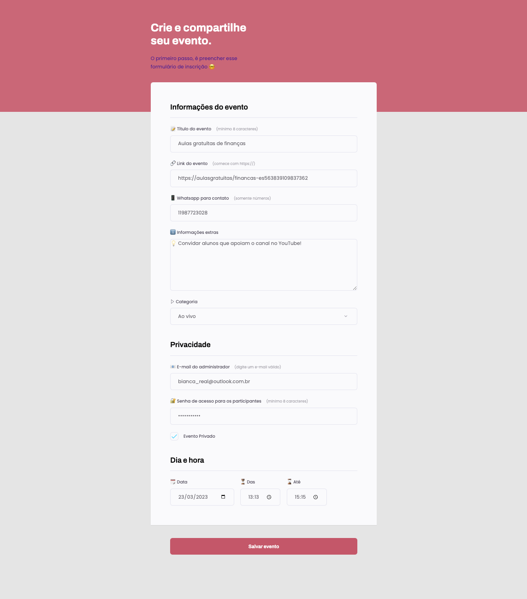
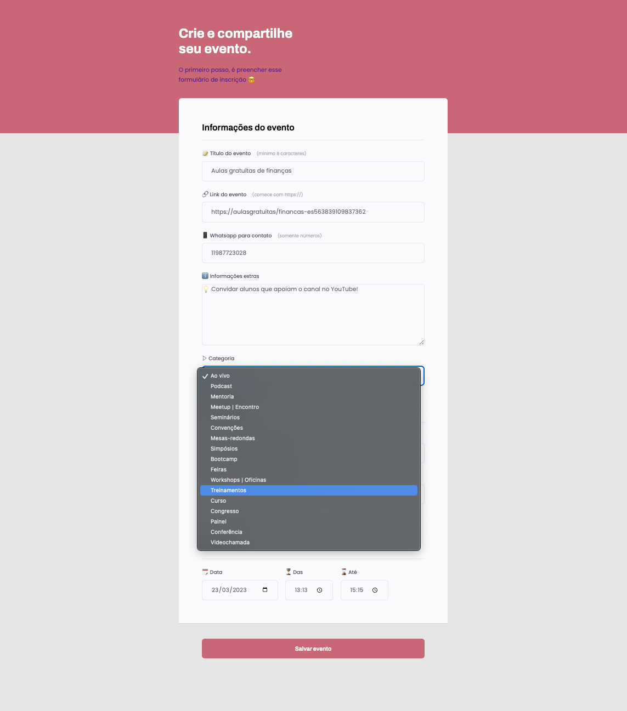

# 📑 _Creating Form_
#### 📄 Criando Formulário 

  

📸 _Screenshot_

# 🚀 _Tecnologies_

 🇺🇸 _This project was developed with the following technologies:_
  
 🇧🇷 Este projeto foi desenvolvido com as seguintes tecnologias: 

 - [HTML](index.html)
 - [CSS](##index.css)
 - [Git e Github](https://github.com/)
 - [Figma](##Figma)

# 👩🏻‍💻 _Project_ 
🇺🇸 _Project made in Rocketseat's course "Explorer"._  
_The idea was to create a form  in HTML e CSS, based on the layout sent Figma._

🇧🇷 Projeto realizado no curso "Explorer" da Rocketseat.  
 A ideia era criar um formulário em HTML e CSS, baseado no layout enviado pela Figma. 

 # 🔗

 - 🇺🇸 [_On-line project here_](///Users/biancamos/Desktop/formulario/index.html?)
 - 🇧🇷 [Projeto on-line aqui](///Users/biancamos/Desktop/formulario/index.html?)

 # 🖋
                   Feito com 🤍 by BM

# 🗓
🇺🇸 March, 2023
 
🇧🇷 Março, 2023
#
